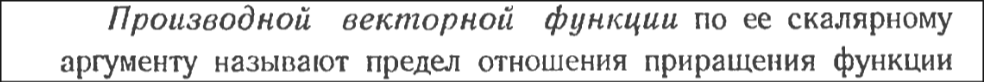
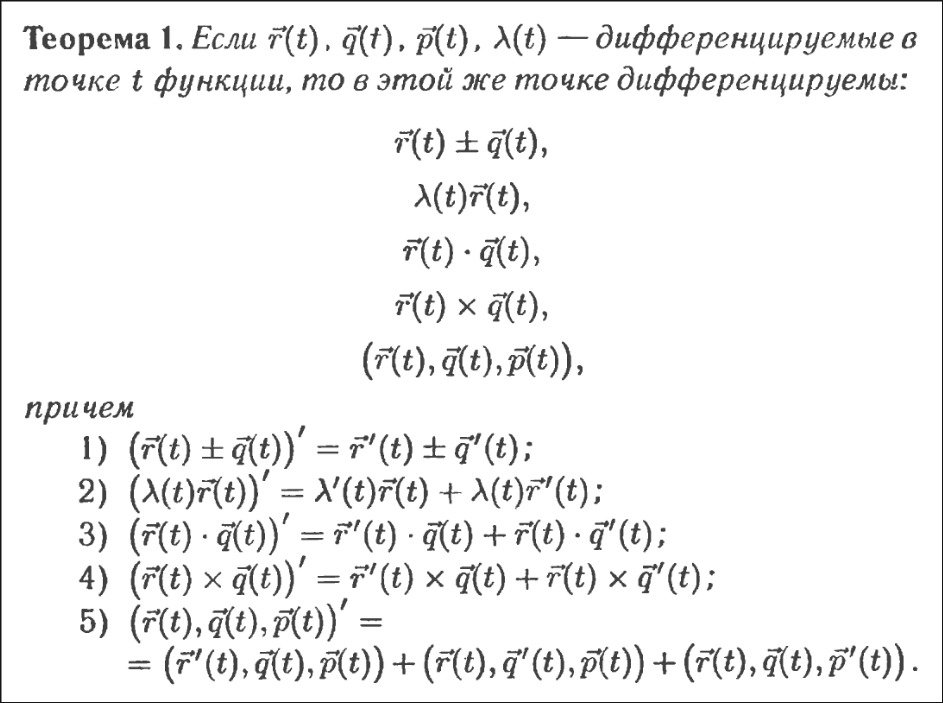
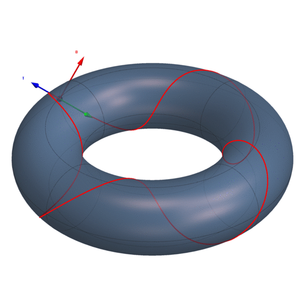

==#В1 приведение к канону==
		Через собственные вектора
		крч, записываем квадратичную форму в матрицу
		находим собственнеы числа, это будут коэфициенты в каноническом уравнении
		ищем собственные вектора, ортаганализуем и записываем в матрицу, порядок важен
		делаем замену
		![[Pasted image 20260601184027.png]]
		каноническую форму для однородной части мы уже нашли и теперь просто подставляем замену в линейные члены
		И объединяем в полные квадраты что осталось
		*пример* https://chat.deepseek.com/share/3ucdhpo09uzbxshg5w
#В2
   ![[Pasted image 20260601175708.png]]
   ![[Pasted image 20260601175745.png]]
или так
![[Pasted image 20260601180626.png]]
![[Pasted image 20260601180644.png]]
#В3 Вектор функция   ![[Pasted image 20260601205948.png]]![[Pasted image 20260601210523.png]]
v - vector
очев что sqrt (sq Vi) <= sqrt(sq x  + sq y + sq z)  ![[Pasted image 20260601211023.png]]![[Pasted image 20260601211808.png]]![[Pasted image 20260601213309.png]]
#В4

#В5 Интеграл вектор-функции
Интегралом вектор функции r называют **семейство** вектор функций, производная которых равна r

И теорема о том, что свойства интегралов вектор функции такие же как и для скалярных функций
#В6
Векторная функция векторного аргумента – соответствие r, при котором каждой точке из множества Q из евклидового пространства Rn сопоставляется вектор из множества Z из евклидового пространства Rm
#В7

параметризация кривой это задание ситемы её уравнений x = x(t) y = y(t) z = z(t), t = (a,b)
кривую можно задать различными параметризациями, типо r(t)  как r(g(t))
кривая называется **регулярной**, если **k** раз дифф-ма и **r(t)' != 0**
если k = 1, то называется **гладкой**

#В8

Нормальная плоскость - плоскость проходящая через точку P и перпендикулярная касательной в этой точке

#В9 Всякие плоскости у кривой

$f (x) = a1 + a2x + a3x^2 + a4x^3 + ...$
$f(x) = b1 + b2(x-a) + b3(x-a)^2 + ...$
$f(x) = f(a) + f'(a)(x - a)$

#В10 Длина кривой и естественная параметризация
\**не очень строгое док-во*

Натуральный параметр — это **длина дуги кривой**, отсчитываемая от выбранной начальной точки M0.

#В11 Кривизны

Док-во

#В12 Кручение

#В13 Формулы френе
тройка касательная, главная нормаль, бинормаль (t, n, b) = 1 называется **Репером Френе**, правая ортонормированная тройка векторовя

поймём, что если t' = kn + vb домножим на b
то получим t'b = knb + vbb
мы знаем что n $\perp$ b как вектор главной норали и бинормаль => nb = 0
вспомним что 
	t = r(s)'
	t' = r(s)'' - вектор главной нормали при естественной параметризации => n, n $\perp$ b => nb = 0
-
и тогда 0 = 0 + v,
	v = 0

тогда (7) заменяем v = 0:
	t'  = kn
	n' ..
	b' = -xn
вспомним |t'| = |r(s)''| - кривизна k(s)
n - единичный вектор поэтому
	t' = k(s)n
вспомним b = r' x r''
у нас b' = (r' x r'')' ... если короче то это формула кручения 

тогда #формулы_френе
	t' = k(s)n
	b' = -x(s)n
	n' = -k(s)t + x(s)b

хз зачем но пусть будет:

#В14
базис подвижной точки (t,n,b) - *канонический подвижный репер*

тоесть получили это

и тип с помощью этого можем проецировать нашу кривую в окрестности какой то точки на естественные плоскости и смотреть как она себя там ведёт
дальше там что то про какие то знаки, скип

#В15 Натуральное уравнение кривой
Из прошлой темы заметим, что у нас получилось разложить кривую чисто по длине дуги, кривизне и кручении
следовательно можно понять, что эти 3 параметра её и определяют. Она являются инвариантами кривой

док-во:
перемещаем $a2(r2(0))$ в $a1(r2(0))$, поворачиваем вторую кривую так чтобы орты френе совпали. Это мы можем сделать потому что у обоих кривых это правые тройки векторов и сами вектора между собой ортоганальны.
тогда введём вспомогательную функцию
$\sigma\ =\ t_1(s)*t_2(s)\ +\ n_1(s)*n_2(s)\ +\ b_1(s)*b_2(s)\ =\ ...$  
берём производную и заменяем

прикол в том, что если $t'_1*t_2 = 0$ то $t_1 = t_2$, с остальными аналогично

#В16 Неявное уравнение кривой на плоскости

или если записать через параметр $F(x(t),\ y(t))$

можно найти частные производные тут

У **плоской** кривой есть особая точка $f(x_0,\ y_0) = f(y_0,\ x_0)\ =\ 0$ 

#В17 эволюта плоской кривой

ур-е нормали в произовльной точке

это получается семейство нормалей кривой, возьмём производную по *S*

получаем

#В18 Эвольвента плоской кривой

#В19
Элементарная поверхность – множество точек пространства, являющееся топологическим отображением круга и ограничивающей его окружности

Граничные точки – границы отображения окружности

Граница элементарной поверхности – замкнутая кривая, образованная граничными точками

Если у элементарных поверхностей части границ или обе границы целиком совпадают – говорят, что они **склеены**

Поверхность – множество точек пространства которое может быть склеено из конечного или счетного множества элементарных поверхностей

*параметрическое уравнение,  а U и V - криволинейные координаты*

*векторное уравнение*

**Регулярная параметризация** — это параметризация $r(u,\ v)$, у которой в каждой точке области определения векторы $r_u\ r_v$ **линейно независимы**, то есть $r_u×r_v≠0$

пример параметризованной поверхности

#В20

это уравнеие **касательной плоскости** к поверхности

**Нормаль поверхности** в точке - нормальный вектор касательной плоскости в точке

Лента Мёбиуса - нету поля нормалей, тк является **односторонней поверхностью**
Если есть поле - двухсторонней

#В21

#В22 Длина дуги на поверхности

#В23 угол между кривыми на поверхности

угол между кривыми на поверхности - угол между их касательными, тоесть

#В24 площадь поверхности
