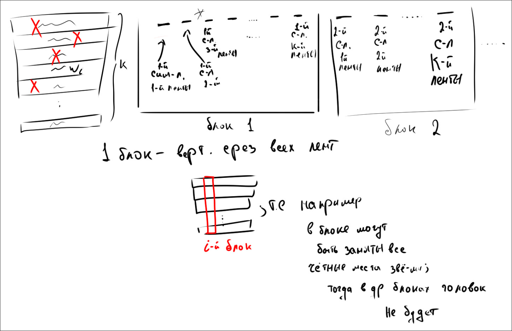

### Графы

- **Графом G** – называется пара элементов G=(V, E), где V – множество вершин графа, E – множество ребер графа
- **Двудольный граф** - граф у которого множество вершин разделено на два подможества и бинарные отношения могут быть определены только между элементами разных подмножеств
- **Цепь** - маршрут, проходящий по каждому ребру графа не более одного раза
- **Цикл** - замкнутая цепь
- **Простая цепь** - маршрут, проходящий по каждой вершине не более одного раза
- **Простой цикл** - замкнутая простая цепь
- **Эйлеров цикл** - цикл, который содержит все рёбра графа по одному разу
- **Гамильтонов цикл** - цикл, содержащий все вершины графа по одному разу
- **Полный граф** - граф, бинарные отношения определены для всех пар вершин
- **Клика** -  подграф графа, образующий полный граф
- Изоморфизм - биекция между вершинами двух графов, при которой сохраняется смежность

#1д 
- об эйлеровом графе
	  Связный граф **обладает эйлеровым циклом** тогда и только тогда, когда **степени всех его вершин четны**.
  
  
- об эйлеровой цепи
	  Связный граф **обладает эйлеровой цепью** (не замкнутой) тогда и только тогда, когда в нем **ровно 2 вершины имеют нечетную степень**. (Начинается в одной из них, заканчивается в другой).
	  
  у нас есть эйлерова цепь, доказываем
  **необходимость** - очев
  **достаточность** - соединяем крайние вершины и получаем эйлеров цикл, значит можем пройти граф по каждому ребру без повторений, а значит если мы разорвём обратно соединение, то свойство сохранится для всего графа
---
- **Графом G** – называется пара элементов G=(V, E), где V – множество вершин графа, E – множество ребер графа
- **Ориентируемый** если бинарное отношение **не** симметрично
- **Неориентированный** если бинарное отношение симметрично
- **Вершины**.
- **Рёбра** - бинарные отношения вершин
- **Петли** - бинарные отношения вида (m, m), т.е. само в себя
- **Смежность** -  связь вершины с вершиной
- **Инциндентность** - связь вершины с ребром
- **Степень вершины** - количество инциндентных рёбер к этой вершине
- **Изолированная вершины** - вершина без инциндентных рёбер
- **Связанный граф** - граф, любые две вершины которого связаны цепью

#2д
- О связанности графа
  Граф G связен тогда и только тогда, когда для любого разбиения множества вершин на два непустых подмножества V1​ и V2 существует хотя бы одно ребро, соединяющее вершину из V1​ с вершиной из V2
	Необходиость - граф связан => две любые вершины связаны цепью => для любого разбиения множества на V1 и V2 найдётся ребро соединяющее точку из v1  с точкой из V2
	Достаточность
	

- пока что скип

#3д 

---
- **Функции алгебры логики (булевые функции)** - это функции f(x1 x2 x3 .. xn), аргументы и значения которых принимаю значения только из {0, 1}
- **Существенная переменная** - изменение которой влияет на значение функции
- **Фиктивная переменная** - изменение которой не влияет на значение функции
- **Равные функции** - у которых таблица истинности совпадает; на сопоставимых наборах аргументов значения функций совпадают
- **Элементарные функции**
  конъюнкция дизъюнкция эквиволентность и тд
- **Суперпозиция** - операция подстановки одних функция вместо аргументов других; *пр. f(x, g(y,z))*
- **Правило поглощения**
  
- **Двойственная функция**
  
  

#11д

- **Теорема о двойственной функции** (часто называется принципом двойственности) утверждает, что если две логические функции равны, то и двойственные им функции также равны.
  

- **Метод Квайна**
  
  пояснение ко второму этапу
  
  
спросить про 

#12д
- 
 
 пояснение на примере
 
 Т.е. если подставить конкретные значения вынесенной переменной и упростим, то получим исхрдную функцию с подставленной переменной

- 

Ничего нового: мы просто берем и раскладываем функцию по первой переменной, потом полученные части — по второй, затем — по третьей, и так до самого конца

#13д

- Карты Вейча
  

  использовать как можно меньше  следующих фигур, чтобы не закрыть нули, и использовать как можно большие фигуры   
  
  
  крайов полей нету, поле замкнуто, т.е. низ - продолжение верха, право - продолжение лева
  
  дальше через наши координаты a b c d выписываем координаты фигур
  
ещё пример

и ещё пример, когда квадрат находится прямо на углах

#14д

- **Теорема Жегалкина** (теорема о существовании и единственности полинома) утверждает, что **любая функция алгебры логики может быть представлена в виде полинома Жегалкина, причем единственным образом** (с точностью до порядка слагаемых).

	Мы знаем* что у любой функции есть СДНФ или СКНФ, построив что то из этого мы можем построить полином жигалкина простоу простив выражение и сделав необходимые замены
	

### Доказательство единственности полинома Жегалкина

Докажем, что одна функция не может иметь два разных полинома Жегалкина.  
Используем комбинаторный подсчёт: сравним количество всех возможных полиномов и количество всех логических функций.

### Общий вид полинома Жегалкина
$$
f(x_{1},\dots ,x_{n}) = a_{0} \oplus a_{1}x_{1} \oplus a_{2}x_{2} \oplus \cdots \oplus a_{12}x_{1}x_{2} \oplus \cdots \oplus a_{1\dots n}x_{1}\dots x_{n}
$$

### Подсчёт числа полиномов
Каждое слагаемое соответствует подмножеству переменных. Число всевозможных произведений (слагаемых) равно числу подмножеств из \(n\) элементов, то есть \(2^{n}\).

Перед каждым слагаемым стоит коэффициент \(a_{i} \in \{0,1\}\):  
\(0\) — слагаемое отсутствует, \(1\) — присутствует.

Общее количество различных полиномов Жегалкина:
$$
\underbrace{2 \times 2 \times 2 \times \cdots \times 2}_{2^{n}\text{ раз}} = 2^{2^{n}}
$$

### Подсчёт числа функций
Число всех функций алгебры логики от \(n\) переменных также равно \(2^{2^{n}}\) (по определению).

### Вывод
Множество из \(2^{2^{n}}\) функций и множество из \(2^{2^{n}}\) полиномов имеют одинаковую мощность.  
Ранее было доказано, что **каждая функция представима хотя бы одним полиномом**.  
Следовательно, между функциями и полиномами существует **взаимно однозначное соответствие**:

- один полином не может принадлежать двум разным функциям,
- одна функция не может иметь два разных полинома.

**Теорема полностью доказана.**

- **Метод Петрика**
  

#19д
**Конечный автомат (абстрактный автомат)** — это математическая модель устройства, которое имеет один вход, один выход и в каждый момент времени находится ровно в одном состоянии из фиксированного конечного множества
Автомат перерабатывает информацию дискретными шагами:

1. Он считывает символ с входной ленты (входной сигнал \(x\)).
2. На основе текущего внутреннего состояния \(s\) и считанного символа \(x\) автомат выполняет два действия:
    - Переходит в новое внутреннее состояние (задается функцией переходов \($\delta)$).
    - Выдает на выход символ (задается функцией выходов \($\lambda$)

надо будет глянуть https://users.math-cs.spbu.ru/~okhotin/teaching/tcs_2025/okhotin_tcs_2025_l4.pdf

#21д

- **Машина Тьюринга** — это абстрактная математическая модель компьютера, представляет собой печатную головку и бесконечную ленту, по которой головка модет двигаться, писать и стирать символы
- **Полнота по Тьюрингу**: свойство системы вычислений (языка программирования, процессора) выполнять абсолютно любой алгоритм, который можно запрограммировать для машины Тьюринга.
- **Тест Тьюринга**: эмпирический тест, предложенный Тьюрингом в 1950 году для оценки искусственного интеллекта. Цель компьютера — в текстовом диалоге обмануть судью, заставив его поверить, что он разговаривает с человеком.

типо три ленты
	1)$q_i\ a_i\ a_l\ D_i$ - тут идут блоки состояний, т.е. номер состояния \ входной символ \ выходной символ \ сдвиг (или остаться) 
	2) рабочая лента, здесь будет слово с которым будет работать машина М
	3) лента хранения текущего состояния машины М
	
